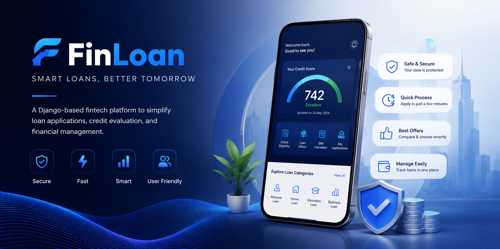

# FinLoan

<p align="center">
  
</p>

<p align="center">
  A Django-based FinTech loan management platform that helps users explore loan options, check eligibility, manage applications, and receive credit-based loan recommendations.
</p>

## Features

* User Registration & Login
* Secure Password Reset with OTP Verification
* Loan Eligibility Checking
* Loan Categories & Recommendations
* User Dashboard
* Loan Details & Application Tracking
* Notification System
* Credit-Based Loan Suggestions
* Responsive UI with Django Templates
* MySQL Database Integration (XAMPP)

## Tech Stack

### Backend

* Python
* Django

### Database

* MySQL (XAMPP)

### Frontend

* HTML
* CSS
* JavaScript
* Django Templates

## Project Structure

```text
fintech-project/
│
├── finloan/
│   ├── migrations/
│   ├── static/
│   ├── templates/
│   ├── models.py
│   ├── views.py
│   └── urls.py
│
├── finova/
│   ├── settings.py
│   ├── urls.py
│   └── wsgi.py
│
├── assets/
│   └── finloan-banner.png
│
├── manage.py
├── .env
└── .gitignore
```

## Installation

### Clone Repository

```bash
git clone https://github.com/Khushi736/Finloan.git
cd Finloan
```

### Create Virtual Environment

```bash
python -m venv myvenv
```

### Activate Virtual Environment

#### Windows

```bash
myvenv\Scripts\activate
```

#### Linux / macOS

```bash
source myvenv/bin/activate
```

### Install Dependencies

```bash
pip install -r requirements.txt
```

## Environment Variables

Create a `.env` file in the project root:

```env
SECRET_KEY=your-secret-key

DB_NAME=finloan_db
DB_USER=root
DB_PASSWORD=
DB_HOST=localhost
DB_PORT=3306
```

## Database Setup

1. Start Apache and MySQL from XAMPP.
2. Create a database named:

```text
finloan_db
```

3. Apply migrations:

```bash
python manage.py migrate
```

## Run Development Server

```bash
python manage.py runserver
```

Open:

```text
http://127.0.0.1:8000/
```

## Security

* `.env` file is excluded from Git tracking.
* Database credentials are stored securely using environment variables.
* Virtual environment files are not included in the repository.

## Future Improvements

* Credit Score Integration
* Loan Recommendation Engine
* KYC Verification Module
* Admin Analytics Dashboard
* Email & SMS Notifications
* API Integration for Financial Services

## Author

**Khushi Yadav**

GitHub: https://github.com/Khushi736
